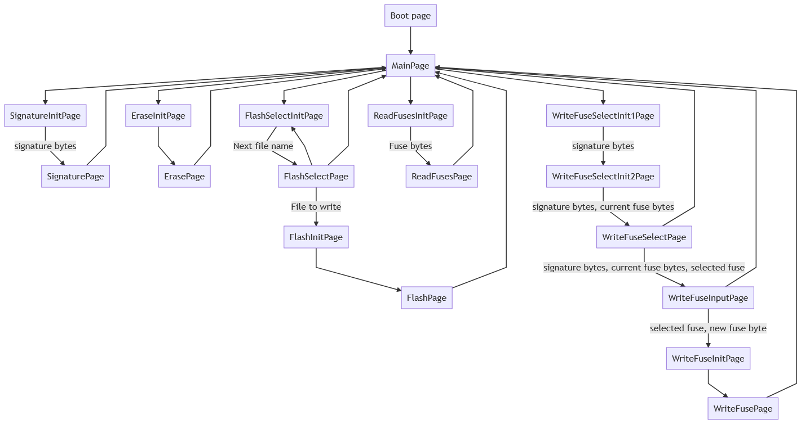

# UIM: User Interface Module

This is the firmware for the lower (on the pcb) chip handling the OLED screen and user input.

Actions are send to the programmer chip via I2C.

# Flowchart of user interaction

